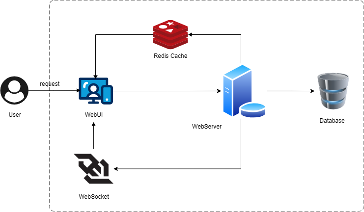
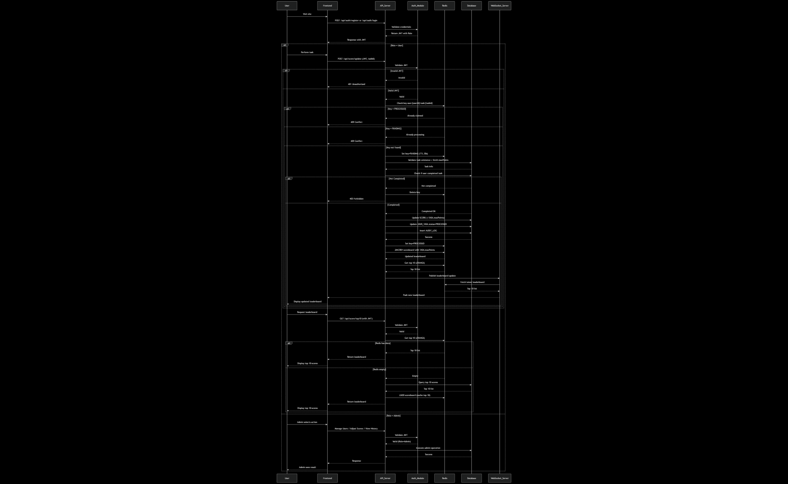
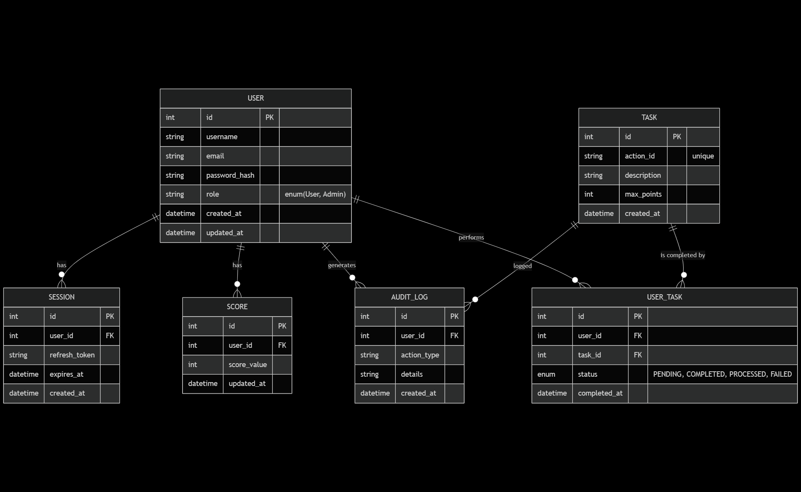

# BE-CodeChallenge-TruongVanThuyen

This folder solves problem number 6 in the backend programming challenge.
# Scoreboard API Service Specification

## 1. Introduction
The **Scoreboard API Service** provides backend functionality for managing a **live-updating scoreboard**.  
It enables:
- Secure **score updates** via authenticated API calls.
- Real-time broadcasting of the **top 10 users’ scores**.
- Role-based access control (User vs Admin).

**Highlight:** Users can only update their own score; Admins can manage/reset scores and view history.

## 2. Overview / Architecture
	•	Frontend: Displays the top 10 scoreboard, receives live updates via WebSocket/SSE.
	•	Backend (Application Server):
	•	Exposes API endpoints to update user scores and retrieve the top 10.
	•	Handles authentication & authorization.
	•	Updates database and cache.
	•	Publishes scoreboard changes to realtime channel.
	•	Database: Stores persistent user scores.
	•	Redis (Cache): Maintains a sorted set of scores for fast retrieval of top 10.
  • Implement anti-cheat mechanisms (e.g., action validation, anomaly detection).

  

## 3. API Specification

### Authentication
All endpoints require a valid JWT token.

### Endpoints

#### `POST /api/auth/register`
**Description:** Register a new user account.
**Request Body:** 
{
  "username": "string",
  "email": "string",
  "password": "string"
}
**Response (201):**
{
  "userId": "uuid",
  "username": "string",
  "email": "string"
}

**Error Codes:**
400 Bad Request → Invalid input
409 Conflict → User already exists

#### `POST /api/auth/login`
**Description:** Authenticate user and return JWT tokens.
**Request Body:**
{
  "username": "string",
  "password": "string"
}

**Response (200):**
{
  "accessToken": "jwt-token",
  "refreshToken": "jwt-refresh-token",
  "expiresIn": 3600
}
**Error Codes:** 401 Unauthorized → Invalid credentials

#### `POST /api/auth/refresh`

**Description:** Refresh expired access token using refresh token.
**Request Body:**
{
  "refreshToken": "jwt-refresh-token"
}

**Response (200):**
{
  "accessToken": "new-jwt-token",
  "expiresIn": 3600
}

**Error Codes:** 401 Unauthorized → Invalid refresh token

#### `POST /api/auth/logout`
**Description:** Revoke user’s refresh token (invalidate session).
**Request Body:**

{
  "refreshToken": "jwt-refresh-token"
}

**Response (200):**

{
  "success": true
}

#### `POST /api/score/update`
**Description:** Increase the user’s score after completing a valid action.
Implements anti-cheat flow with Redis-first check, DB fallback, and idempotent updates.
**Request Body:**

{
  "userId": "string",
  "increment": number,
  "taskId": "string"
}

**Validation Rules:**
- userId must match the authenticated user (from JWT).
- taskId must exist in the system (table TASKS).
- The user must have completed the task before claiming points (USER_TASKS.status = COMPLETED).
- Server ignores client-provided increment → server calculates points = TASKS.maxPoints.
**Duplicate Claim Prevention:**
- Redis-first check:
  + Key: user:{userId}:task:{taskId}.
  + If value = PROCESSED → reject immediately.
  + If value = PENDING → reject (already processing).
  + Else → set value = PENDING with TTL (e.g., 30s) before processing.

- DB constraint: UNIQUE(user_id, task_id) in USER_TASKS ensures one-claim rule.
**Processing Flow:**
If validations pass and no duplicate claim:
- Update SCORES → increment user score by TASKS.maxPoints.
- Update Redis leaderboard → ZINCRBY leaderboard {points} user:{userId}.
- Update USER_TASKS.status = PROCESSED.
- Write to AUDIT_LOG (userId, taskId, points, timestamp, status).
- Set Redis key user:{userId}:task:{taskId} = PROCESSED.
Error Handling:
- If DB/Redis error: rollback DB transaction + mark task as FAILED.
- Redis key is reset to avoid deadlock in PENDING state.
**Response (200):**
{
  "success": true,
  "newScore": 125
}
**Error Codes:**
400 Bad Request → Invalid input
401 Unauthorized → Invalid or missing token
403 Forbidden → User has not completed the required action 
409 Conflict → Duplicate claim (task already processed).

#### `GET /api/score/top10`
**Description:** Retrieve the top 10 users by score.
**Response (200):**
[
  { "userId": "user1", "score": 150 },
  { "userId": "user2", "score": 140 }
]

#### `GET /api/score/:userId`
**Description:** Get the current score of a specific user.
**Response (200):**
{
  "userId": "user1",
  "score": 150
}
**Error Codes:** 404 Not Found → User does not exist

#### `GET /api/score/history/:userId`
**Description:** Retrieve the score change history for a user (audit purpose).
**Response (200):**
{
  "userId": "user1",
  "history": [
    { "timestamp": "2025-09-06T12:00:00Z", "increment": 10, "newScore": 120 },
    { "timestamp": "2025-09-06T12:05:00Z", "increment": 5, "newScore": 125 }
  ]
}
**Error Codes:** 
400 Bad Request → userId invalid
404 Not Found -> userId not found

#### `POST /api/score/reset`
**Description:** Reset scores (admin only).
**Request Body (optional):**
{
  "scope": "all" | "user",
  "userId": "string"
}
**Response (200):**
{ "success": true }
**Error Codes:** 403 Forbidden → User not authorized

#### `DELETE /api/score/:userId`
**Description:** Delete a user’s score (admin only, e.g., cheating detected).
**Response (200):**
{ "success": true }
**Error Codes:**
403 Forbidden → User not authorized
404 Not Found → User does not exist

#### `GET /api/health`
**Description:** Check health of system services (DB, Redis, WebSocket).
**Response (200):**
{
  "status": "ok",
  "timestamp": "2025-09-06T12:30:00Z",
  "services": {
    "database": "up",
    "redis": "up",
    "websocket": "up"
  }
}
**Response (503):**
{
  "status": "degraded",
  "timestamp": "2025-09-06T12:30:00Z",
  "services": {
    "database": "up",
    "redis": "down",
    "websocket": "up"
  }
}

#### `WebSocket /scoreboard`
**Description:** Subscribe to live scoreboard updates.
**Events:**
scoreUpdated:
{ "userId": "user1", "newScore": 125 }

leaderboardUpdated:
[
  { "userId": "user1", "score": 150 },
  { "userId": "user2", "score": 140 }
]

### Authentication & User Management
| Method | Path                 | Description                           | Auth | Role    |
|--------|----------------------|---------------------------------------|------|---------|
| POST   | `/api/auth/register` | Register a new user                   | No   | Public  |
| POST   | `/api/auth/login`    | Authenticate user & return JWT tokens | No   | Public  |
| POST   | `/api/auth/refresh`  | Refresh access token                  | No   | Public  |
| POST   | `/api/auth/logout`   | Invalidate refresh token / logout     | Yes  | User    |

### Score Management
| Method | Path                        | Description                            | Auth | Role       |
|--------|-----------------------------|----------------------------------------|------|------------|
| POST   | `/api/score/update`         | Increase user score after an action    | Yes  | User       |
| GET    | `/api/score/top10`          | Get top 10 users’ scores               | Yes  | User       |
| GET    | `/api/score/:userId`        | Get score of a specific user           | Yes  | User       |
| GET    | `/api/score/history/:userId`| Get score history (audit log)          | Yes  | User/Admin |
| POST   | `/api/score/reset`          | Reset scores (all or specific user)    | Yes  | Admin      |
| DELETE | `/api/score/:userId`        | Delete a user’s score (cheating case)  | Yes  | Admin      |

### Real-time Updates
| Protocol | Path          | Description                         | Auth | Role |
|----------|--------------|-------------------------------------|------|------|
| WS       | `/scoreboard`| Subscribe to live scoreboard updates| Yes  | User |

### System Health
| Method   | Path          | Description                         | Auth | Role |
|----------|--------------|-------------------------------------|------|-------|
| GET      | `/api/health`| Check health of system services     | No   | Public|

## 4. Flow of Execution (Diagram)
**sequenceDiagram**
    participant User
    participant Frontend
    participant API_Server
    participant Auth_Module
    participant Redis
    participant Database
    participant WebSocket_Server

    User->>Frontend: Visit site
    Frontend->>API_Server: POST /api/auth/register or /api/auth/login
    API_Server->>Auth_Module: Validate credentials
    Auth_Module-->>API_Server: Return JWT with Role
    API_Server-->>Frontend: Response with JWT

    alt Role = User
        User->>Frontend: Perform task
        Frontend->>API_Server: POST /api/score/update (JWT, taskId)
        API_Server->>Auth_Module: Validate JWT
        alt Invalid JWT
            Auth_Module-->>API_Server: Invalid
            API_Server-->>Frontend: 401 Unauthorized
        else Valid JWT
            Auth_Module-->>API_Server: Valid
            API_Server->>Redis: Check key user:{userId}:task:{taskId}
            alt Key = PROCESSED
                Redis-->>API_Server: Already claimed
                API_Server-->>Frontend: 409 Conflict
            else Key = PENDING
                Redis-->>API_Server: Already processing
                API_Server-->>Frontend: 409 Conflict
            else Key not found
                API_Server->>Redis: Set key=PENDING (TTL 30s)
                API_Server->>Database: Validate task existence + fetch maxPoints
                Database-->>API_Server: Task info
                API_Server->>Database: Check if user completed task
                alt Not Completed
                    Database-->>API_Server: Not completed
                    API_Server->>Redis: Delete key
                    API_Server-->>Frontend: 403 Forbidden
                else Completed
                    Database-->>API_Server: Completed OK
                    API_Server->>Database: Update SCORE (+TASK.maxPoints)
                    API_Server->>Database: Update USER_TASK.status=PROCESSED
                    API_Server->>Database: Insert AUDIT_LOG
                    Database-->>API_Server: Success
                    API_Server->>Redis: Set key=PROCESSED
                    API_Server->>Redis: ZINCRBY scoreboard with TASK.maxPoints
                    Redis-->>API_Server: Updated leaderboard
                    API_Server->>Redis: Get top 10 (ZRANGE)
                    Redis-->>API_Server: Top 10 list
                    API_Server->>WebSocket_Server: Publish leaderboard update
                    WebSocket_Server->>Redis: Fetch latest leaderboard
                    Redis-->>WebSocket_Server: Top 10 list
                    WebSocket_Server-->>Frontend: Push new leaderboard
                    Frontend-->>User: Display updated leaderboard
                end
            end
        end

        User->>Frontend: Request leaderboard
        Frontend->>API_Server: GET /api/score/top10 (with JWT)
        API_Server->>Auth_Module: Validate JWT
        Auth_Module-->>API_Server: Valid
        API_Server->>Redis: Get top 10 (ZRANGE)
        alt Redis has data
            Redis-->>API_Server: Top 10 list
            API_Server-->>Frontend: Return leaderboard
            Frontend-->>User: Display top 10 scores
        else Redis empty
            Redis-->>API_Server: Empty
            API_Server->>Database: Query top 10 scores
            Database-->>API_Server: Top 10 list
            API_Server->>Redis: ZADD scoreboard (cache top 10)
            API_Server-->>Frontend: Return leaderboard
            Frontend-->>User: Display top 10 scores
        end
    else Role = Admin
        User->>Frontend: Admin selects action
        Frontend->>API_Server: Manage Users / Adjust Scores / View History
        API_Server->>Auth_Module: Validate JWT
        Auth_Module-->>API_Server: Valid (Role=Admin)
        API_Server->>Database: Execute admin operation
        Database-->>API_Server: Success
        API_Server-->>Frontend: Response
        Frontend-->>User: Admin sees result
    end

**erDiagram**
 USER {
        int id PK
        string username
        string email
        string password_hash
        string role "enum(User, Admin)"
        datetime created_at
        datetime updated_at
    }

    SESSION {
        int id PK
        int user_id FK
        string refresh_token
        datetime expires_at
        datetime created_at
    }

    SCORE {
        int id PK
        int user_id FK
        int score_value
        datetime updated_at
    }

    TASK {
        int id PK
        string action_id "unique"
        string description
        int max_points
        datetime created_at
    }

    USER_TASK {
        int id PK
        int user_id FK
        int task_id FK
        enum status "PENDING, COMPLETED, PROCESSED, FAILED"
        datetime completed_at
    }

    AUDIT_LOG {
        int id PK
        int user_id FK
        string action_type
        string details
        datetime created_at
    }

    USER ||--o{ SESSION : "has"
    USER ||--o{ SCORE : "has"
    USER ||--o{ AUDIT_LOG : "generates"
    USER ||--o{ USER_TASK : "performs"
    TASK ||--o{ USER_TASK : "is completed by"
    TASK ||--o{ AUDIT_LOG : "logged"

## 5. Non-functional Requirements
- **Security:** All endpoints require authentication. Input validation and rate limiting are enforced.
- **Performance:** Score updates and leaderboard queries must complete within 200ms.
- **Scalability:** Support at least 10,000 concurrent WebSocket connections.
- **Reliability:** 99.9% uptime, with automatic failover.
- **Rate Limiting:**  max 100 requests per minute per IP, Exceeding the limit returns `429 Too Many Requests`. 
- **Monitoring:** Log all score updates, track failed update attempts.
- **Security:** All update requests require authentication.

## 6. Deployment
	•	Environment variables:
  	- DB_URL (database connection)
  	- REDIS_URL (Redis connection)
    - JWT_SECRET (for authentication)
	•	Dependencies:
 	  - Database (MySQL/Postgres)
	  -	Redis (for cache + sorted set ranking)
	•	Run locally: npm run start:dev

## 7. Improvement Suggestions
- Support pagination for larger leaderboards.
- Integrate with external authentication providers.
- Add metrics and monitoring (Prometheus/Grafana).
- Consider using Redis for fast leaderboard operations.
